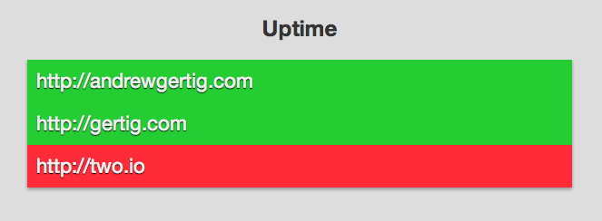

## What is Uptime?

Uptime is a Sinatra application that can be used to check to see if a website is currently up or down and then send you a Text message to alert of its change in status.

## Getting Started

Start application with:

    $ git clone git://github.com/AndrewGertig/uptime.git
    $ cd uptime
    $ bundle
    $ createdb yourappname
    
Using [Foreman, .env, and a Procfile](https://devcenter.heroku.com/articles/procfile#developing-locally-with-foreman)
    
    $ foreman start

To access and change data via the console

    $ irb
    $ require './app.rb'
    
Create your first Site

    $ Site.create(url: "http://andrewgertig.com")
    
Open your browser to whichever PORT you are using, (for me I have it set to PORT=5002 in my .env file so http://localhost:5002) and you should see something like this:



Green means the site is up, Red means it's down. I used to own two.io but couldn't ever figure out what to do with it :disappointed:
    
## Twilio Setup

1. Get a Twilio SMS account
2. Add your phone number and keys to your .env file
3. Add your Twilio keys to Heroku config

````
$ heroku config:add MY_TWILIO_NUM=5558675309 TWILIO_ACCOUNT_SID=XXXXXXXXXSIDXXXXXXXX TWILIO_ACCOUNT_TOKEN=XXXXXXXXTOKENXXXXXXXX
````

## SendGrid Setup

If you want emails to be sent, configure [SendGrid](https://addons.heroku.com/sendgrid).

1. Run `heroku addons:add sendgrid:starter`
2. Set your email address `ENV` variable: `heroku config:add MY_EMAIL_ADDRESS=me@here.com`
    
## Heroku Scheduler

In order to check to see if a site is "UP" or "DOWN" you will need to setup a scheduled rake task using Heroku's Scheduler

    $ heroku addons:add scheduler:standard
    $ heroku addons:open scheduler
    
Create a Job that runs "rake check\_sites" every 10 minutes, it should look like this once you are done: 

  
  
## Configuring Your Heroku Instance

To use the `Datamapper` methods (below), you need to remotely connect to the console on Heroku. To do this, run: `heroku run console` then `require './app.rb'`


## Datamapper Basics

**Create**

    $ Site.create(url: "http://andrewgertig.com")

**Find**

    $ Site.get(1)
    $ Site.first(:url => "http://andrewgertig.com")

**Destroy**

    $ site = Site.get(5)
    $ site.destroy  # => true

####[Datamapper Documentation](http://datamapper.org/docs/)